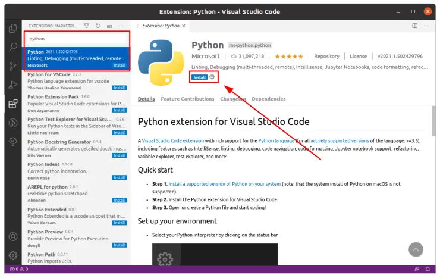

# Menggunakan Visual Studio Code

Visual Studio Code (VSCode) adalah IDE cukup populer digunakan untuk menuliskan script Python.

Untuk menggunakan VSCode, pertama [download dan install](https://code.visualstudio.com/download).

Sesudah instalasi VSCode, install [Python extension](https://marketplace.visualstudio.com/items?itemName=ms-python.python) untuk VSCode. Sebelum install Python extension, pastikan Python sudah terlebih dahulu ter-install.

